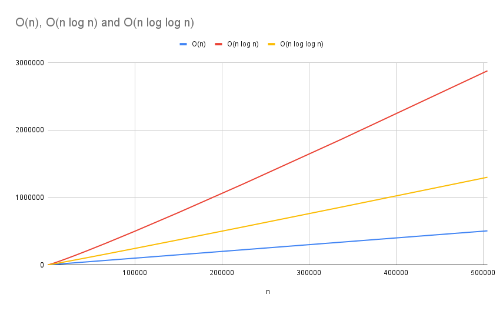

Entire code to create tables and graphs for the [Statistical sorting in O(n) publication](./Sorting/sorting2.pdf)

Just execute ./run.sh on [Linux](https://www.kernel.org/)

Note: the reason is that it is really O(n log log n) which is way closer to O(n) than O(n log n). Also, it is known as nested bucket sorting with requirement of sqrt(n) of buckets for list with n members. Otherwise it would not be close to O(n). So sqrt(n) as number of buckets is important. This will be updated in new pdf file. Coming soon-ish.

